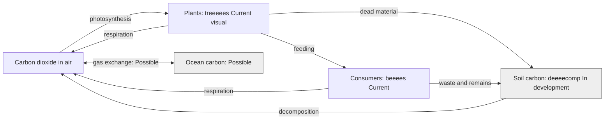

# Where carbon goes

**Author: eeeearth · 2026-10-02 · Version 1 · Draft · Readers: students · Reading time: 3 minutes**

Carbon moves among air, living things, soil, water and rock. Plants take carbon dioxide from air and make sugars. Animals get carbon by eating. Respiration and decomposition return some carbon dioxide to air. Oceans exchange carbon dioxide with air, while rock processes act over much longer times. [NASA describes the fast and slow carbon cycles](https://science.nasa.gov/earth/earth-observatory/the-carbon-cycle/).

**Text route:** plants take carbon from air; feeding passes it to animals; remains pass it to soil. Respiration and decay return some carbon to air. Oceans also exchange carbon with air. **Legend:** arrows follow carbon; the two-headed arrow shows exchange. Grey `In development` and `Possible` nodes are not established live-scene roles.

The stream shows plants and animals, but a visible tree is not a measurement of carbon uptake. eeeearth models local scenes and does not cover the global ocean or deep-rock carbon cycle.

Next: [photosynthesis](photosynthesis.md) · [guide](README.md)
