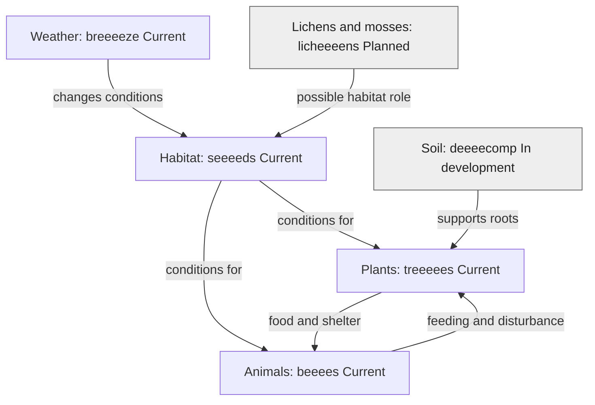

# How habitats and species connect

**Author: eeeearth · 2026-10-02 · Version 1 · Draft · Readers: students · Reading time: 3 minutes**

An **ecosystem** includes living things and the air, water and land around them. **Biodiversity** means the variety of life. A habitat supplies conditions that organisms need. Changing temperature, water or a feeding link can affect more than one species. [USGS describes ecosystems and biodiversity resources](https://www.usgs.gov/educational-resources/ecosystems-education).

**Text route:** weather and soil affect habitat conditions. Habitat supports plants and animals; plants and animals affect one another. Lichens and mosses may later add habitat detail. **Legend:** arrows show relationships, not measured strengths. Grey `In development` and `Planned` nodes mark incomplete simulation roles.

seeeeds holds species and place data for local scenes. A single scene cannot show all species in a region, and the planned species-network graph is not yet a working public view.

Next: [food webs](food-webs.md) · [guide](README.md)
