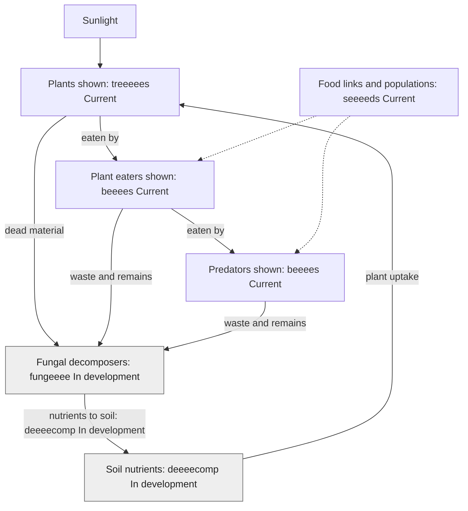

# How food moves energy through an ecosystem

**Author: eeeearth · 2026-10-02 · Version 1 · Draft · Readers: students · Reading time: 3 minutes**

Plants use sunlight to make food. A plant eater gets some of that stored energy by eating a plant. A predator gets energy by eating another animal. Decomposers feed on waste and remains. A **food web** joins several feeding paths. Its arrows point from food to eater. [NOAA explains food-web arrows](https://www.noaa.gov/education/resource-collections/marine-life/aquatic-food-webs).

**Text route:** sunlight supports plants. Plant eaters eat plants; predators eat other animals. Decomposers feed on dead material and waste. Nutrients can return to soil and enter plants again. **Legend:** solid arrows show energy transfer or named matter flow; dashed arrows show seeeeds data supporting scene relationships. Energy leaves living things as heat, so the nutrient arrow does not recycle energy. Grey `In development` labels show non-live roles. [NOAA's teaching guide distinguishes energy flow from matter cycling](https://repository.library.noaa.gov/view/noaa/37768/noaa_37768_DS1.pdf).

seeeeds holds food links and population data for the scene. A planned species-network view remains a roadmap item; this graph teaches the idea and does not depict that view as available.

Next: [decomposition](soil.md) · [guide](README.md)
