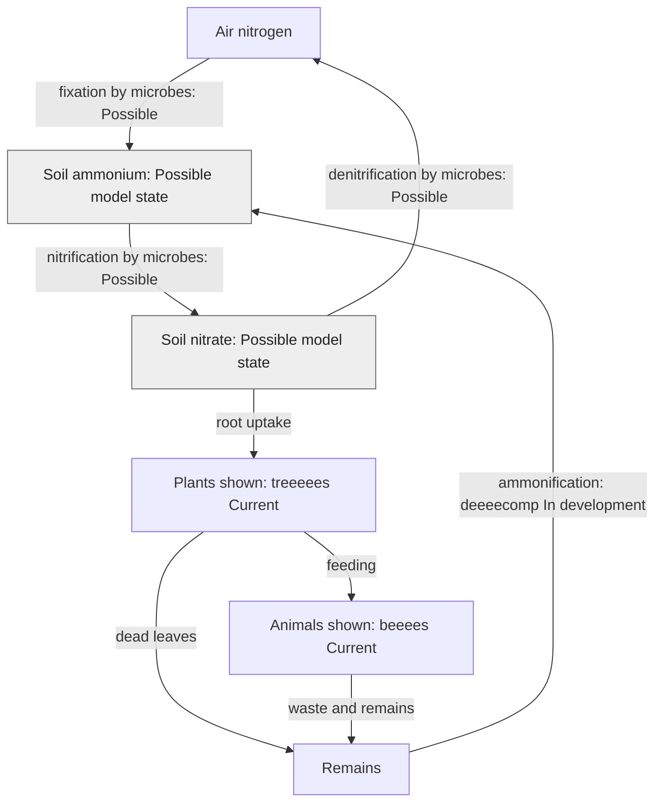

# How nitrogen and phosphorus reach living things

**Author: eeeearth · 2026-10-02 · Version 1 · Draft · Readers: students · Reading time: 4 minutes**

Plants need nitrogen to build proteins. Most cannot use nitrogen gas from air directly. Certain microbes **fix** it into usable forms. Other microbes change ammonium into nitrate, which roots can take up. Decomposers return nitrogen from dead material to soil. Still other microbes return nitrogen gas to air. [NASA's nitrogen-cycle lesson](https://mynasadata.larc.nasa.gov/basic-page/energy-and-matter-cycles) describes these steps.

**Text route:** microbes move nitrogen from air to soil ammonium, then to nitrate. Roots take it into plants; animals gain it by feeding. Waste and dead matter return nitrogen to ammonium. Other microbes return nitrate nitrogen to air. **Legend:** arrows follow nitrogen. `Current` names the visible plant and animal roles. Grey `In development` and `Possible` labels mark steps the live scene does not yet establish.

Phosphorus follows a different route. Weathering releases it from minerals in rock and soil. Plants take up dissolved phosphorus; animals gain it by feeding. Decomposition returns it to soil, while runoff can carry it into water. Unlike nitrogen, its main cycle has no large atmospheric-gas step. [USGS discusses soil phosphorus and parent material](https://pubs.usgs.gov/sir/2017/5118/sir20175118_element.php?el=15).

**Module boundary:** geeeeo is planned to supply rock and parent-material context. deeeecomp develops living soil layers and nutrient state. Neither role implies a complete phosphorus cycle in the live scene.

Next: [photosynthesis](photosynthesis.md) · [guide](README.md)
