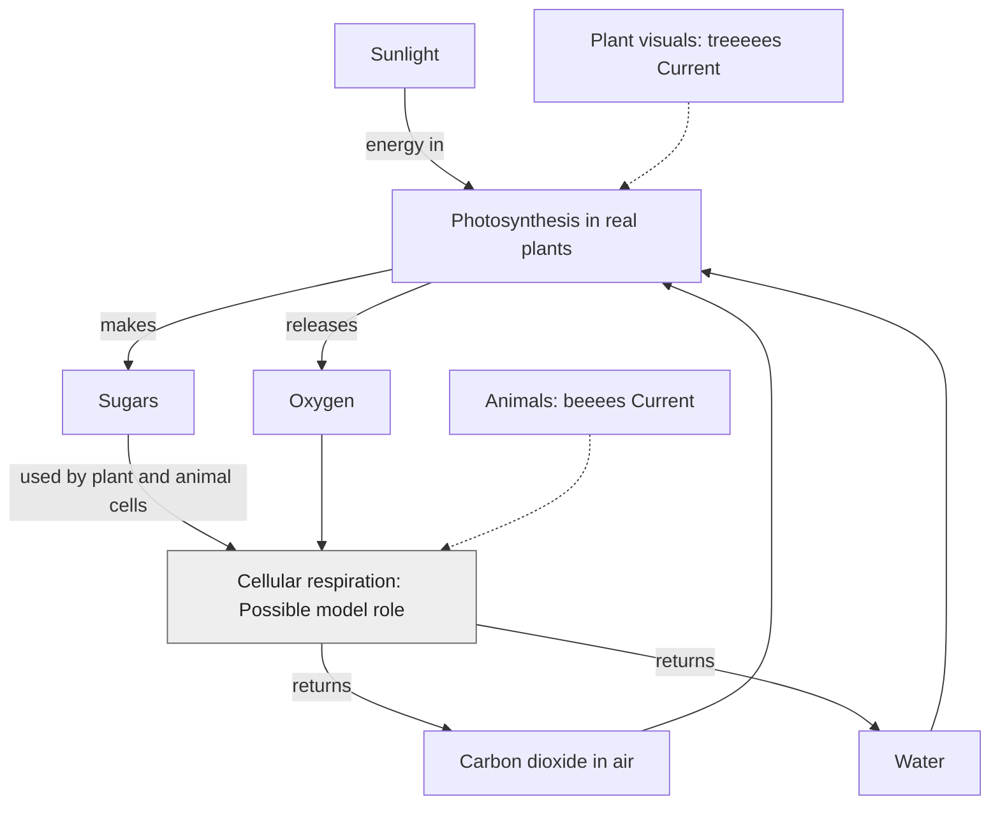

# How plants store energy, and cells release it

**Author: eeeearth · 2026-10-02 · Version 1 · Draft · Readers: students · Reading time: 3 minutes**

In **photosynthesis**, plants use sunlight to turn carbon dioxide and water into sugars and oxygen. In **cellular respiration**, living cells use sugars and oxygen to release usable energy, returning carbon dioxide and water. Plants respire too. [NASA explains both reactions](https://science.nasa.gov/earth/earth-observatory/the-carbon-cycle/).

**Text route:** sunlight, carbon dioxide and water enter photosynthesis. Plants make sugar and release oxygen. Plant and animal cells use sugar and oxygen in respiration, returning carbon dioxide and water. **Legend:** solid arrows show inputs and products; dashed arrows connect current scene visuals to real biological processes. They do not claim measured reaction rates. `Current` refers to plant and animal representation. Grey `Possible` refers to biochemical modeling that is not established in the live scene.

treeeees builds plant shapes and beeees describes animals. Seeing leaves or breathing animations would not by itself prove that a simulation computes photosynthesis or respiration. These reactions explain real life; the overlay marks representation in eeeearth.

Next: [carbon](carbon.md) · [guide](README.md)
