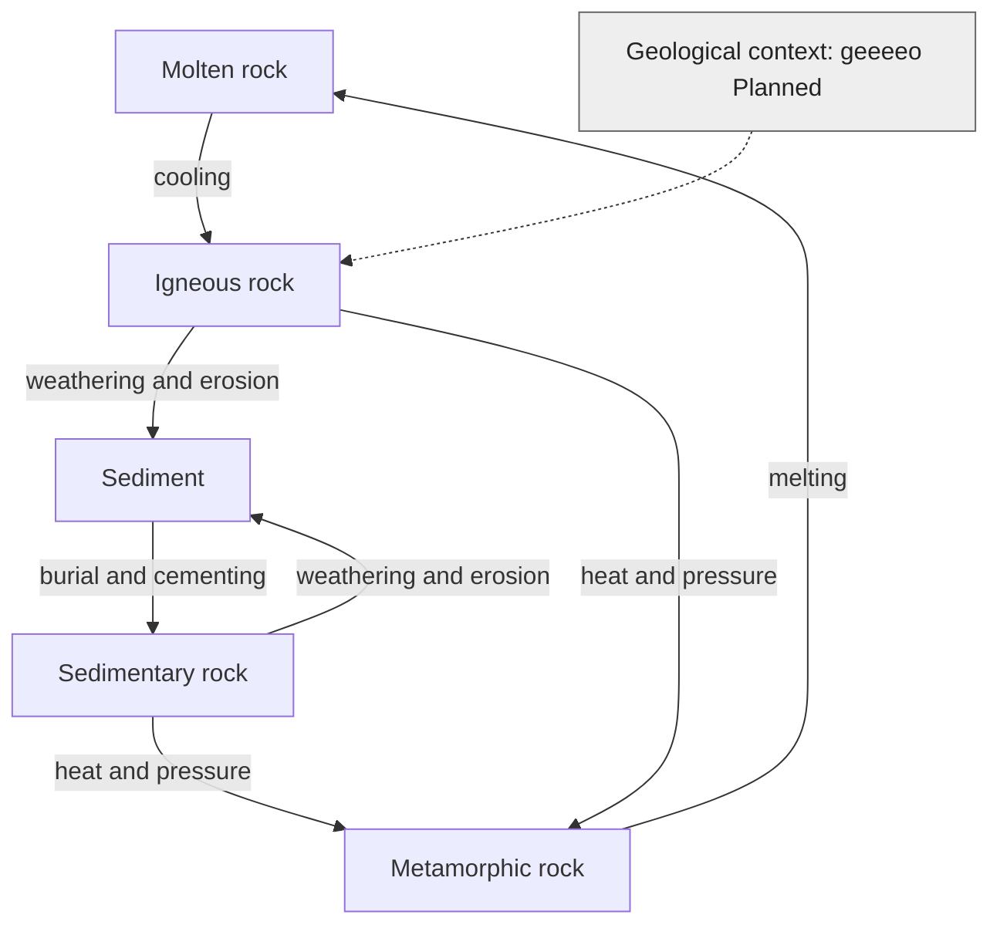

# How rocks change

**Author: eeeearth · 2026-10-02 · Version 1 · Draft · Readers: students · Reading time: 3 minutes**

Molten rock cools into **igneous rock**. Weathering breaks exposed rock into sediment; burial and cementing can make **sedimentary rock**. Heat and pressure can change existing rock into **metamorphic rock** without melting it. Melting begins another path toward igneous rock. A rock can take more than one route through this cycle. [USGS describes the three rock groups](https://www.usgs.gov/educational-resources/earth-materials-scavenger-hunt-activity).

**Text route:** molten rock cools into igneous rock; exposed rock can break into sediment; sediment can become sedimentary rock; heat and pressure can make metamorphic rock; melting makes molten rock again. Other routes also exist. **Legend:** arrows show possible geological changes, not a fixed sequence. Grey `Planned` node indicates geeeeo's future context role; the process itself is real science.

geeeeo is planned to describe bedrock and surface materials for local scenes. It does not yet simulate the rock cycle. deeeecomp develops the living soil above or within that material.

Next: [soil](soil.md) · [guide](README.md)
