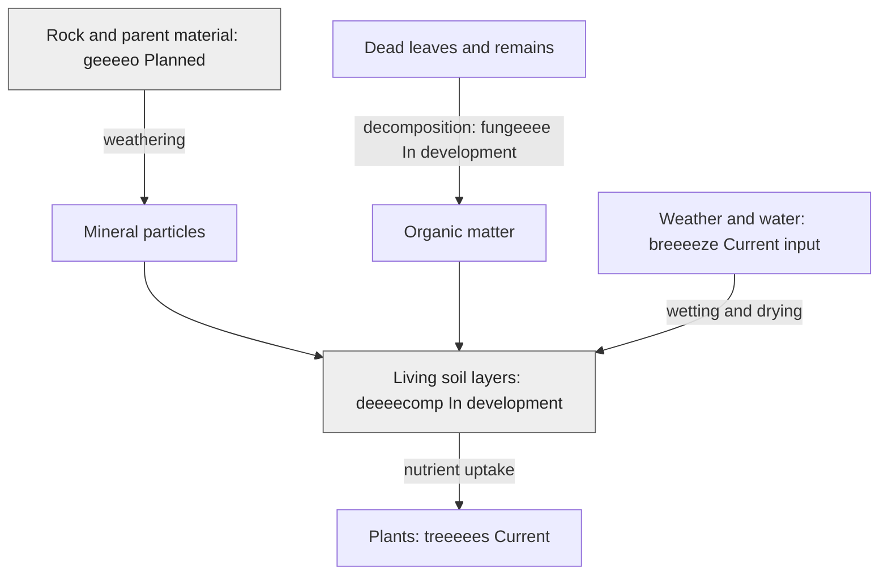

# How remains break down and soil forms

**Author: eeeearth · 2026-10-02 · Version 1 · Draft · Readers: students · Reading time: 3 minutes**

Fungi, bacteria and soil animals break down dead plants and animals. Some material becomes soil organic matter; nutrients become available to living plants again. Soil also forms as rock and other **parent material**, the material soil develops from, changes over time. Climate, living things and landscape position shape the result. [USDA explains the five soil-forming factors](https://www.nrcs.usda.gov/sites/default/files/2022-11/from-the-surface-down.pdf).

**Text route:** weathering supplies mineral particles; decomposers turn remains into organic matter. Both contribute to soil, which supports plants. Weather and water affect these changes. **Legend:** arrows show contributions, not a complete soil-forming timeline. Grey `Planned` and `In development` nodes show project status.

geeeeo is planned to supply bedrock, surface geology, rocks and parent-material context. deeeecomp owns living soil horizons, water, temperature and nutrient state. A rock may appear in an underground cutaway through a documented fixture, which does not mean geeeeo is implemented. Licheeeens could later represent organisms growing on rock and soil; it remains planned.

Next: [rocks](rocks.md) · [guide](README.md)
