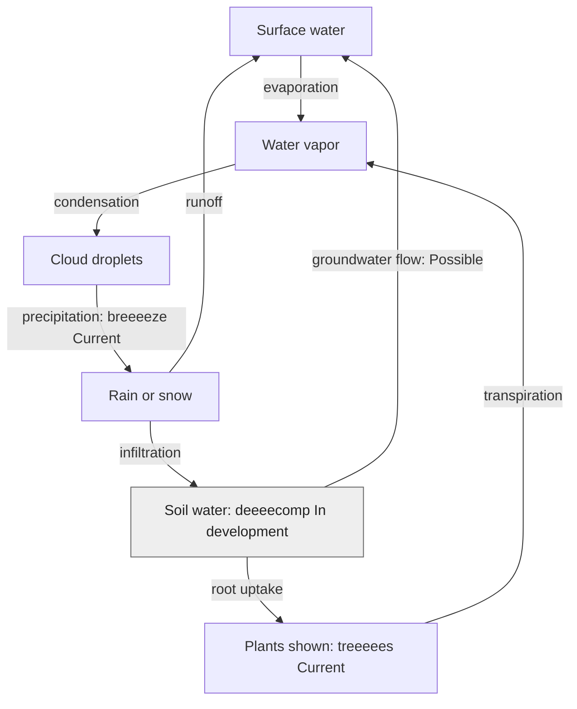

# Where water goes

**Author: eeeearth · 2026-10-02 · Version 1 · Draft · Readers: students · Reading time: 3 minutes**

Sunlight warms liquid water. Some becomes water vapor, a gas, and rises. Cooling turns vapor into tiny cloud droplets. Rain or snow brings water back to the surface. Water may run downhill, soak into soil, or enter plants and later leave their leaves as vapor. This is the water cycle. [NASA explains these paths](https://science.nasa.gov/earth/earth-observatory/the-water-cycle/).

**Text route:** surface water evaporates into vapor; vapor condenses into clouds; clouds release rain or snow. Rain can run to surface water or soak into soil. Plants take up some soil water and release vapor. Some underground water returns to surface water. **Legend:** arrows follow water. `Current` labels show scene inputs or plants, not a complete water-cycle model. Grey `In development` and `Possible` labels show incomplete coverage.

In eeeearth, breeeeze supplies changing weather and treeeees builds the plants you see. deeeecomp has soil-water code in development. The diagram does not claim that the stream measures evaporation, groundwater or transpiration. [USGS describes infiltration and runoff](https://www.usgs.gov/water-science-school/learn-about-water).

Next: [nutrients](nutrients.md) · [guide](README.md)
