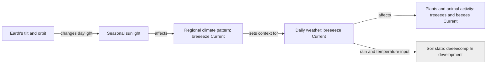

# Weather, climate and seasons

**Author: eeeearth · 2026-10-02 · Version 1 · Draft · Readers: students · Reading time: 3 minutes**

**Weather** is what the air is doing over a short time: temperature, wind, rain or snow. **Climate** describes the longer pattern of weather in a place. A cold day can happen in a warming climate. [NASA explains the difference](https://climatekids.nasa.gov/weather-climate/).

Seasons arise because Earth's axis is tilted as Earth travels around the Sun. That changes daylight and the angle of sunlight during the year. Seasonal changes affect plants, soil water and animal activity. [NOAA explains seasonal effects](https://www.noaa.gov/education/resource-collections/climate/changing-seasons).

**Text route:** tilt and orbit change seasonal sunlight; climate describes the longer regional pattern; daily weather varies within it. Weather affects organisms and soil. **Legend:** arrows show influences, not a claim that climate causes each daily event. Grey `In development` marks soil-state integration beyond the established live scene.

breeeeze supplies regional profiles and changing weather. The scene is local; it is not a global climate forecast.

Next: [water](water.md) · [guide](README.md)
